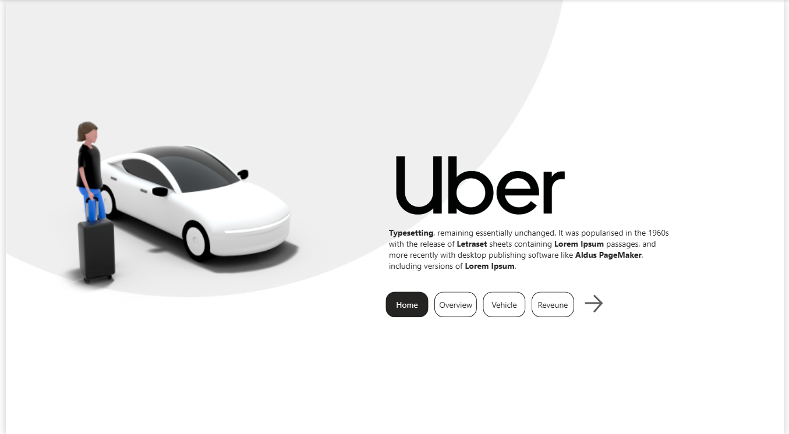
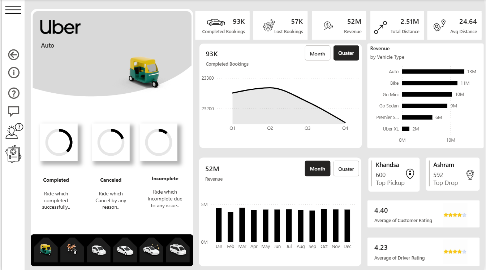
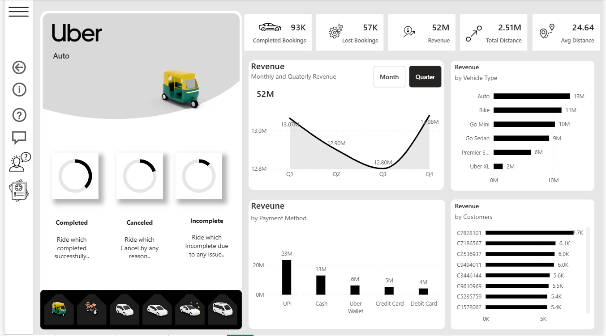
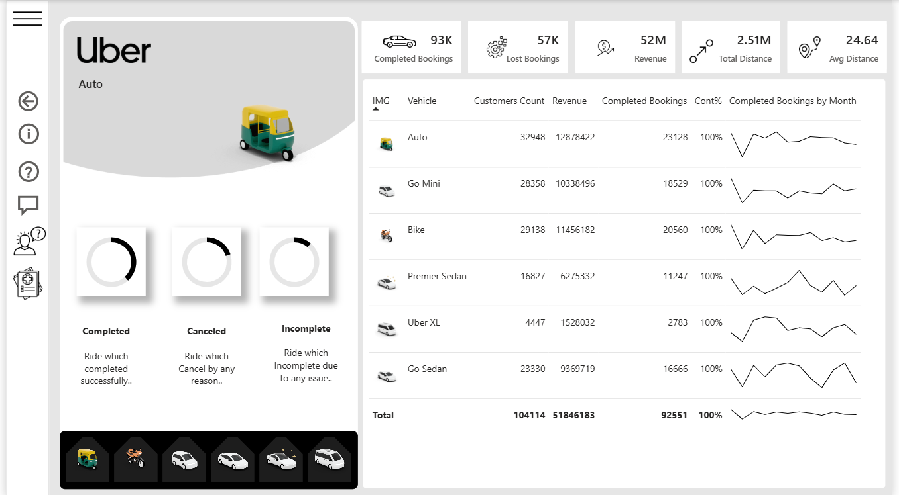

# 🚖 Uber Ride Analytics Dashboard (Power BI)

An interactive **Power BI dashboard project** that analyzes Uber ride data to generate insights on bookings, revenue, vehicles, payments, and customer behavior.

This dashboard helps understand **business performance, ride patterns, and customer trends** using visually interactive reports.

---

# 📊 Dashboard Pages

## 🏠 Home Page
Overview of the Uber dashboard with navigation and quick insights.

---

## 📈 Overview Dashboard
Shows key metrics including:

- Completed Bookings
- Lost Bookings
- Total Revenue
- Total Distance
- Average Distance
- Vehicle Type Revenue
- Customer Ratings
- Top Pickup and Drop Locations

---

## 💰 Revenue Analysis
Revenue insights including:

- Quarterly Revenue Trends
- Monthly Revenue Distribution
- Revenue by Vehicle Type
- Revenue by Payment Method
- Revenue by Customer

---

## 🚗 Vehicle Performance
Detailed breakdown of vehicle performance including:

- Customers by Vehicle
- Revenue by Vehicle
- Completed Bookings
- Monthly booking trends per vehicle

---

# 🛠 Tools Used

- **Power BI**
- **Data Visualization**
- **Data Cleaning**
- **DAX Measures**
- **Interactive Filters & Slicers**

---

# 📊 Key Insights

✔ Auto rides generate the highest revenue  
✔ UPI is the most used payment method  
✔ Peak bookings observed in Q1 & Q4  
✔ Certain vehicles show higher customer demand

---

# 🎯 Project Purpose

This project demonstrates **data analysis and visualization skills** using Power BI by transforming raw ride data into meaningful business insights.

---

# 👨‍💻 Author

**Abhishek Memane**
